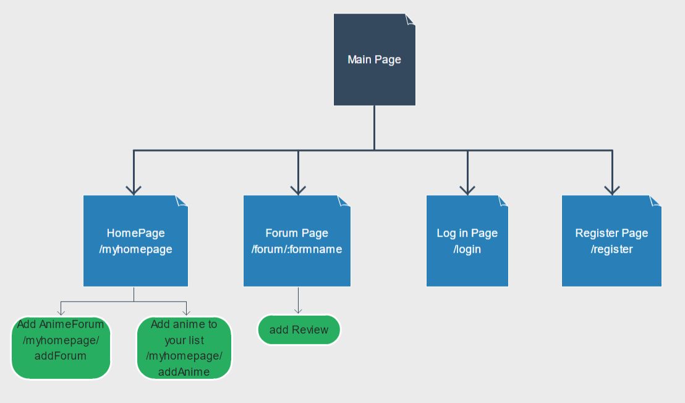

Overview:
I want to make a site of anime forum. In this site, people can log in to their account to add their anime list. 
They can add their anime, rate them, and add their own reviews. 
They can also see ¡°forums¡±: comments for some other people. 
The comments can be shown in time order or in specific anime. 

Data Model:
The application will store users, anime items, and forums.
1.The user can have one list of animation. 
2.The review database will store all the anime reviews

User example:
{ username: string
 Password: (password hash),
 listOfAnime: array of string
}

review example:
{animename: string,
reviewContent: string,
reviewerUserName: string,
Rating: number,
reviewDate: date(YYYY-MM-DD string)
}

Routes:
This site will have pages:
'/' is the main page which people can log in or take a look at newest reviews 
'/login' is the login page
'/forum' is the site for forums(parameter will be added for specific anime)
'/myhomepage' is the homepage
'/myhomepage/add' is the page for adding review for an anime

Sitemap:

Research Topic:
1. Headless Chrome
2. Mocha

I feel like testing is important for projects, and will be useful when I get to work. So I want to research these topics. 

==================================
Milestome #2
1. the working form is add forum and add anime to list in the /myhomepage (after log in)
2. headless chrome